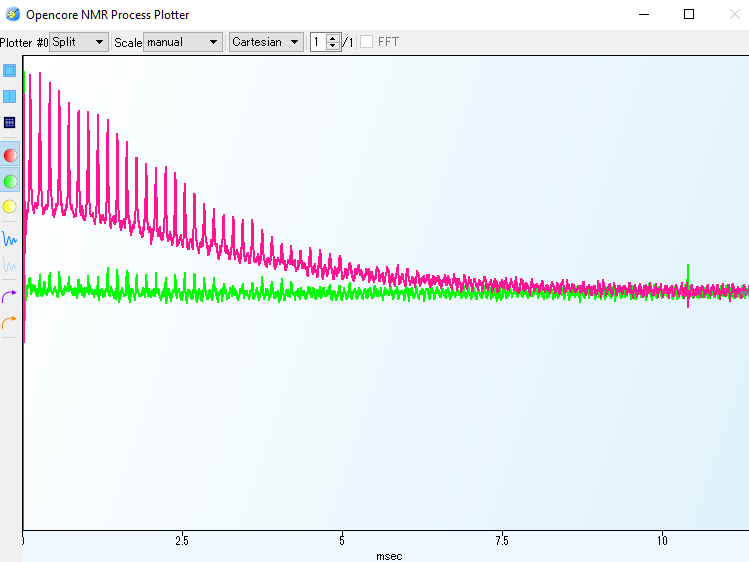

# Getting Started with a 5 mm CPMAS probe

We assume that you alrerady have a system that works. That is, we assume that you have a system composed of an Opencore NMR spectrometer, a magnet, a probe, power amplifiers, a low-noise amplifier, and so on. Here I will describe below experimental settings toward 1H-13C CPMAS in our ca. 7 T magnet.

- **TODO**: photos

### A single-pulse 79Br experiment in KBr
-  Rotor ID: 33L1012 (KBr 50 mg, adamantane 48.6 mg mixture)

##### Finding the right condition
- Frequency:  75.0469 MHz
- Sample position (how far you insert the probe into the magnet bore): 360 mm above the bottom flange of the magnet.
- Amplitude of the rf pulse and its optimal duration

##### Adjustment of the magic angle
- We started repeat scanning of 79Br FID from KBr powder spinning at ca. 7 kHz, and observed rotational echoes.
- By inspecting the FIDs, we adjusted the knob on the probe dedicated for magic-angle adjustment, so that the train of the rotational echoes lasted as long as possible. Then we believed that the spinning axis became close to ideal, i.e., *the magic angle* $\cos^{-1}(1/\sqrt{3})$.  

### A single-pulse 1H experiment in adamantane

- The power of radiofrequency pulses was too low. Recently, we found one power amplifier was out of order, and replaced it by another one. It seems we need more input power for the replaced one.

